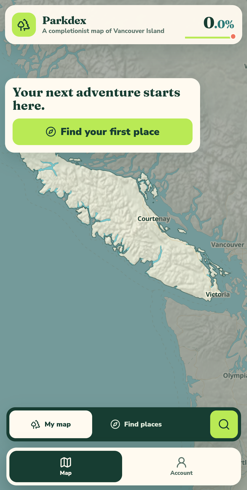
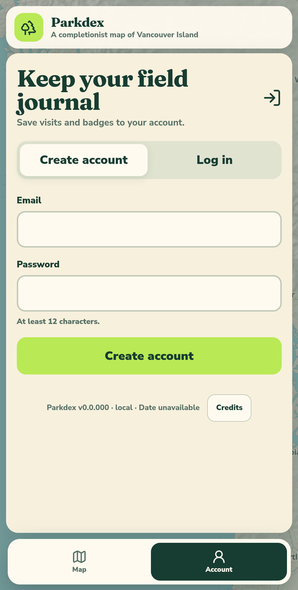

# Android app emulator evidence

The prior mobile-web baseline is captured in [production-mobile-home.png](../issues40-47/before/production-mobile-home.png). There was no Android application before this change.

The following captures are cropped to the application viewport from the API 36 `Parkdex_API_36` emulator after installing the locally built debug APK.

## Bundled map

The bundled MapLibre map, boundaries, staging catalogue, safe areas, and guest navigation rendered successfully. Android-deferred location is absent while the web control remains unchanged.

## Email account entry

Email/password registration and login remain available. Google sign-in is intentionally absent until a native system-browser callback is implemented.

The same emulator run also verified a staging registration, force-stop/relaunch session restoration, Goldstream Park visit and unvisit synchronization, external-link handoff to Chrome, and a clean cold-launch log without application console or fatal errors.
