# Field Guide and My Dex visual evidence

The before images are retained staging captures from the Sealed Impressions and staging design audit evidence. The after images are cropped from the actual app at 390 × 844, using a disposable local account with six confirmed visits and no private photographs. Different record counts are intentional test data, not a migration comparison. The local Next.js indicator may appear in the navigation capture.

| Surface | Before | After |
| --- | --- | --- |
| Navigation and map | 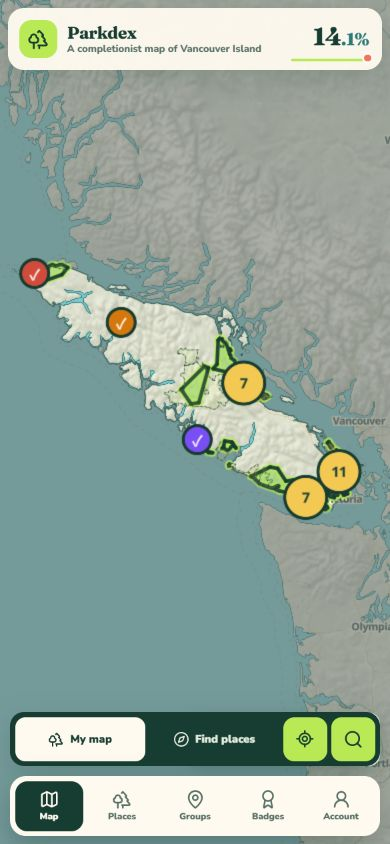 | 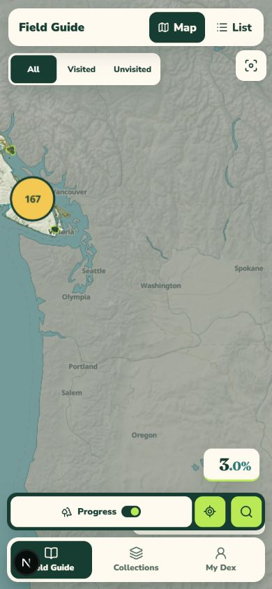 |
| My Dex shelves |  | 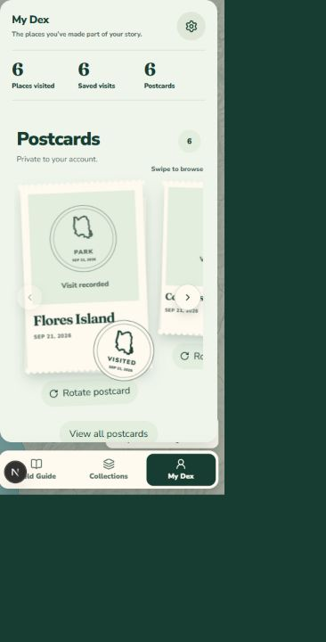 |
| Collections | 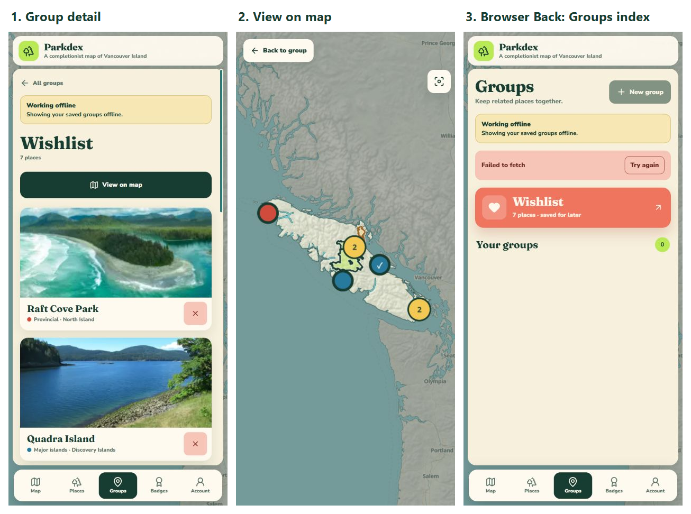 | 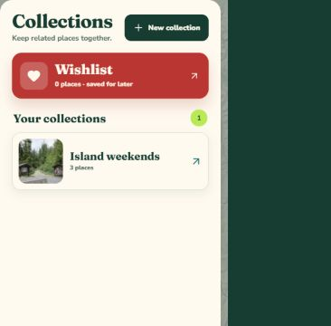 |
| Account organization | 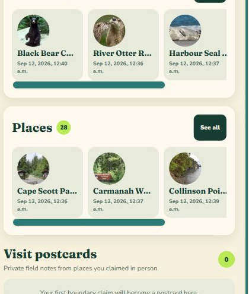 | 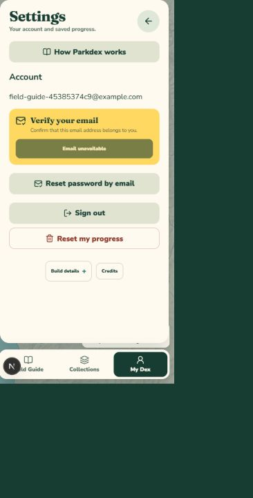 |
| Place details | 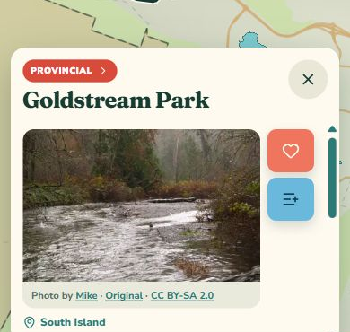 | 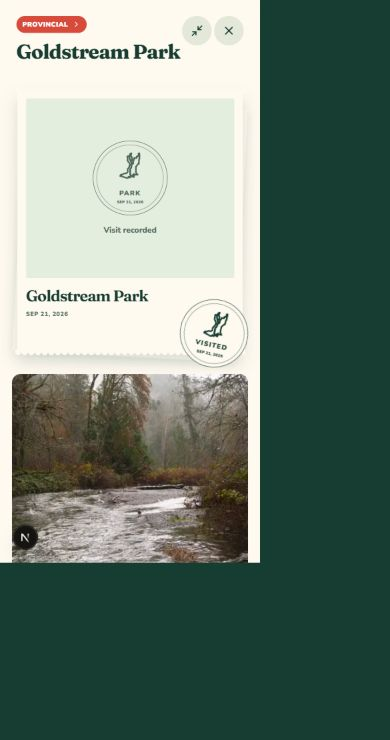 |

The combined Field Guide list and three-screen onboarding are new arrangements:

| List search | Onboarding |
| --- | --- |
| 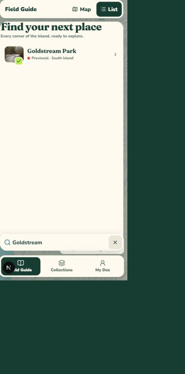 | 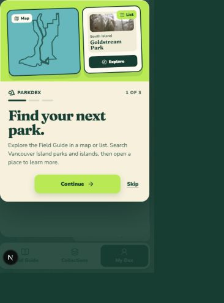 |

Local browser checks covered 320, 390, 768, and 1280 pixel widths; collection-to-map navigation; detail Close/Back/Forward; postcard rotation and expansion; Settings; and onboarding replay. At 768 pixels, the map search, category tray, and bottom navigation share exact 10-pixel side gutters. Deployed browser verification is reported separately in the pull request. These captures are not Android or private-photo storage attestations.
