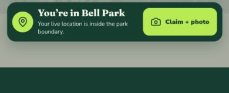
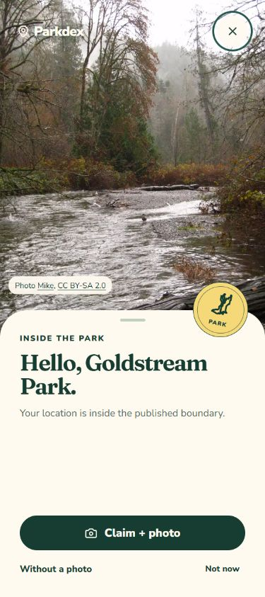
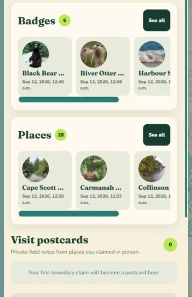
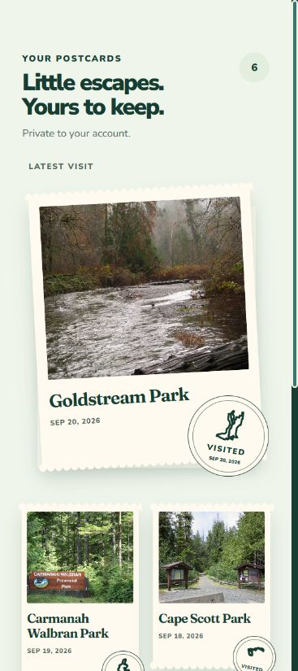
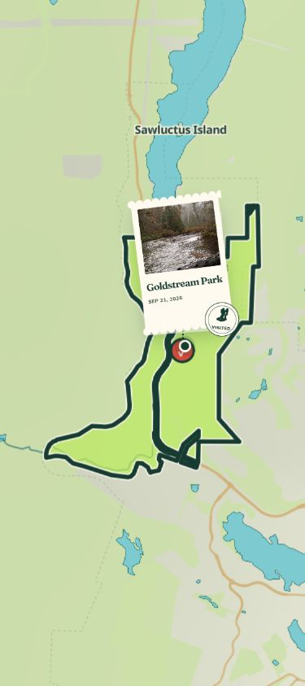
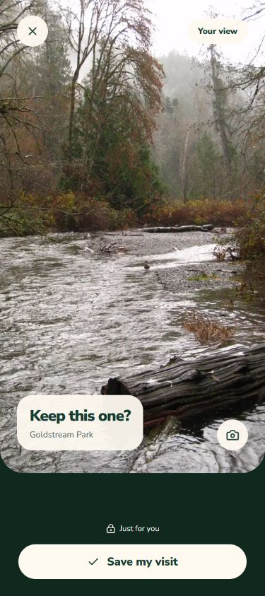
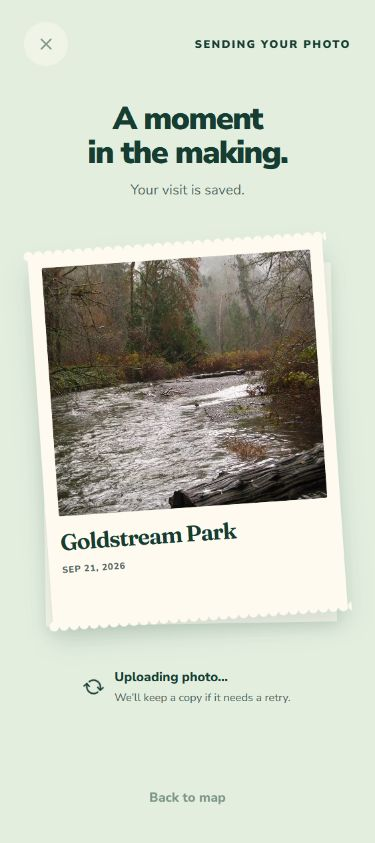
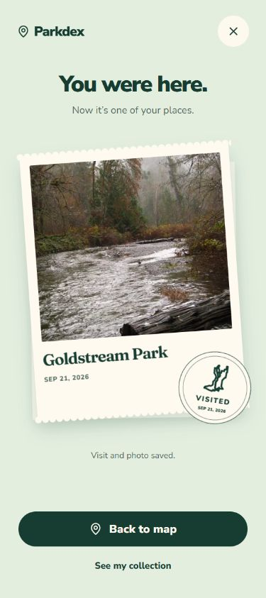

# Sealed Impressions visual evidence

The before captures show the staging account and PR 107 claim banner. The after captures use the actual React components at 375 × 844 in a temporary local visual harness. The harness supplies catalogue photographs as clearly controlled sample visits and has been removed from the application. These screenshots establish layout, not native camera or server verification.

| Before | After |
| --- | --- |
|  |  |
|  |  |
|  |  |

| Review after native capture | Upload in progress | Saved impression |
| --- | --- | --- |
|  |  |  |

The component pass covered 320, 375, 414, and 768 pixel widths. The private photograph stays the focal point, and the cream paper remains consistent during saving, success, and collection display. Actual deployed and Android checks are recorded separately in the PR validation report.
